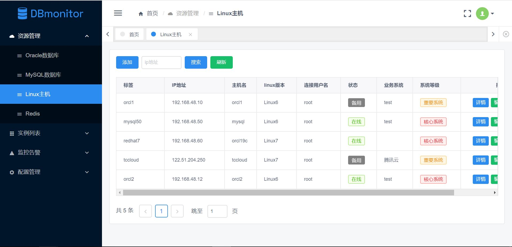
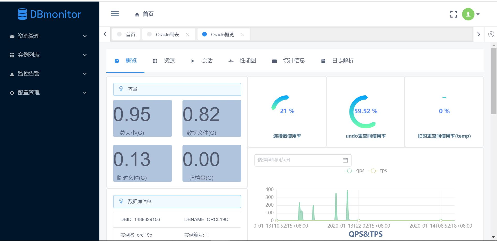

# DB monitor数据库监控平台

## 特性
- **构建**: 前后端分离架构，Python+Django+restframework提供后台API，celery定制数据采集策略，Iview作为前端展示
- **UI**: 开箱即用的高质量前端设计，提供丰富的图表、指标展示，核心数据形成趋势图分析
- **深度定制**: 提供完整可用的数据监控方案，告别冗长的SQL脚本、常用手册，复杂数据通过web页面即可轻易浏览

## 功能简介

- 资源管理
    - 支持Oracle/MySQL/Redis/Linux资源情况录入，涵盖大部分日常所需信息，形成完整资产库
    - 资源管理中各类设备信息作为采集设备来源，支持动态加入实例监控列表
    
...待补充

## 环境

- Python 3.6
    - Django 2.2
    - Django Rest Framework 3.1
    
- Vue.js 2.9
    - iview 3.4

## 平台使用
- [在线访问](http://122.51.204.250:8080/) (推荐使用chrome浏览器)
  
用户名：admin 
密码：111111

## 安装部署
#### 1. 安装python3.6(略)

#### 2. 安装mysql5.7(略)

注意字符集：utf-8

create database db_monitor; 

#### 3. 安装redis3.2(略)

#### 4. 安装oracle instant client(略)

#### 5. 项目配置

##### 下载源代码
git clone https://github.com/gumengkai/db_monitor

##### 安装依赖包
pip install -r requirements.txt

##### settings配置
--MySQL数据库：

DATABASES = {  
    'default': {  
        'ENGINE': 'django.db.backends.mysql',  
		'NAME': 'db_monitor',  
		'USER': 'root',  
		'PASSWORD': 'mysqld',  
        'HOST':'127.0.0.1',  
		'PORT': '3306',  
    }
}

--Redis：

CELERY_RESULT_BACKEND = 'redis://localhost:6379/1'

CELERY_BROKER_URL = 'redis://localhost:6379/2'

--邮件配置：

IS_SEND_EAMIL = 0 #是否发送告警邮件，0：不发送 1：发送

EMAIL_BACKEND = 'django.core.mail.backends.smtp.EmailBackend' #一般不需要修改

EMAIL_HOST = 'smtp.163.com'

EMAIL_PORT = 25

EMAIL_HOST_USER = '*********'    # 邮箱登录名，如11111111111@163.com

EMAIL_HOST_PASSWORD = '*********'   #此处为客户端授权码，不是邮箱密码，需要在邮箱服务商设置

EMAIL_TO_USER = ['1782365880@qq.com','gumengkai@hotmail.com'] # 发送邮件列表,参考格式设置

##### 创建数据库
python manage.py makemigrations

python manage.py migrate

python manage.py createsuperuser(创建登录用户)

##### 执行数据库脚本

@install/initdata.sql

#### 6. 启动
python manage.py runserver 0.0.0.0:8000 #建议使用固定IP地址启动

celery –A db_monitor worker –l info

celery –A db_monitor beat –l info

也可以使用脚本启动/关闭：

celery: sh celery_start[shutdown].sh

django: sh web_start[shutdown].sh

关于日志：

celery日志：logs/celery-worker.log & logs/celery-beat.log

web日志： logs/django-web.log

采集数据异常主要查看celery日志！

#### 7. 前端配置
请参考：[db_monitor_vue](https://github.com/gumengkai/db_monitor_vue)

#### 8. oracle数据库监控
对Oracle数据库监控，请在被监控端建立用户，并执行install/sqlscripts(forOracle)中的脚本

grant.sql & table.sql & procedure.sql

## 界面展示

- 资产管理

- Oracle数据库概览

- oracle top sql

- MySQL数据库日志解析

- 告警记录

- 告警配置

## 交流学习
- QQ群 916746047

另外，安装过程中出现的问题可优先查看此文档：
https://docs.qq.com/doc/DZHlBSGFGd1lpWUVS

Copyright © 2019 DB monitor

